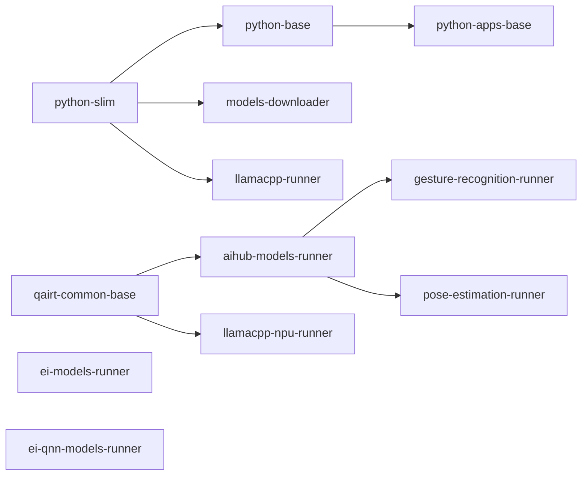

# Containers

Every container image produced by this repo lives here, one directory per image.

## Layout

One directory per container, `containers/<name>/`. The directory name is the container's identity: its
image name — `ghcr.io/arduino/app-bricks/<name>` — its target in `docker-bake.hcl` and the value used in
the `containers` input of the dev workflow. Every release publishes every container (see
[Release process](#release-process)); what each one is for is told by the [inventory](#inventory).

## Inventory

| Container | Built `FROM` | Purpose |
|---|---|---|
| `python-slim` | `python:3.13-slim-trixie` | Minimal Python layer shared by everything else |
| `python-base` | `python-slim` | System deps, non-root user, fonts, OpenCV wheel, libcamera + GStreamer packages |
| `qairt-common-base` | `python:3.13-slim-trixie` | Qualcomm AI Runtime and FastRPC libraries shared by the NPU runners |
| `python-apps-base` | `python-base` | App runtime: installs the Arduino App Bricks `.whl` and the Streamlit config |
| `models-downloader` | `python-slim` | Downloads models from AI Hub, Edge Impulse and Hugging Face per `models/models-list.yaml` |
| `aihub-models-runner` | `qairt-common-base` | Runs Qualcomm AI Hub models, with GStreamer/WebSocket input and MJPEG/WebSocket output |
| `gesture-recognition-runner` | `aihub-models-runner` | Hand-gesture recognition on the MediaPipe palm/landmark/classifier models |
| `pose-estimation-runner` | `aihub-models-runner` | Body pose estimation on the PoseNet MobileNet model, 17 keypoints per person, custom pose models supported |
| `ei-models-runner` | Edge Impulse inference image | Edge Impulse inference with the bundled out-of-the-box models |
| `ei-qnn-models-runner` | Edge Impulse QNN inference image | Same, on the NPU-accelerated (QNN) models |
| `llamacpp-runner` | `python-slim` | llama.cpp model router, CPU build |
| `llamacpp-npu-runner` | `qairt-common-base` | llama.cpp model router, Hexagon NPU build |

`ei-models-runner` and `ei-qnn-models-runner` build on external Edge Impulse images and have no upstream
inside this repo.

## Anatomy of a container directory

| Path | Required | Description |
|---|---|---|
| `Dockerfile` | yes | Build recipe, with the image's build arguments (download URLs, digests) as `ARG` defaults. The directory itself is the build context, declared by the container's `docker-bake.hcl` target. |
| `pyproject.toml` + `uv.lock` | if Python packages are installed | The Python packages the image installs, declared in `pyproject.toml` and pinned with hashes in `uv.lock` by `task deps:lock`. The Dockerfile installs from the lock, `task deps:sync` installs the same packages into a local `.venv` for IDE support. Board-only packages carry an environment marker. Never install packages inline, the [dependency license scan](../scripts/licensed/README.md) only sees the lock |

| `tests/` | no | Python tests run by `task test` in the container's `.venv`, with the packages of its `test` dependency group; shell tests exercise the built image |

SBOMs are not kept in the tree: they are generated from the published images at release time (see
[SBOMs](#sboms)) and by the dev workflow as run artifacts.

An image that derives from another container in this repo declares it once, in its Dockerfile:
`FROM ${REGISTRY}app-bricks/<parent>:${BASE_IMAGE_VERSION}`, with both `ARG`s declared before it. Its
`docker-bake.hcl` target links the same parent with `parent_context()`, so bake builds the parent
in-graph first; `scripts/container_deps.py` reads the `FROM` line for everything else (dev build
selection, SBOM base image, `task containers:tree`) and the release fails if the two disagree.

See the [docker-bake.hcl reference](../.github/README.md#docker-bakehcl-reference) for the variables CI sets.

## Release process

Running `docker-publish.yml` with version `X.Y.Z` publishes **every container** at `X.Y.Z`, attaches the
Python `.whl` and the SBOMs of every image to the GitHub Release and creates the `release/X.Y.Z` tag. The library and the
containers it runs always ship together, so the compose files bundled in the wheel reference the images
published by the same release (see [Compose file versioning](../.github/README.md#compose-file-versioning)).

The workflow builds every container with one `docker buildx bake` invocation. Bake resolves the
dependency order from the parent links in `docker-bake.hcl`, so `python-slim` is built before
`python-base`, which is built before `python-apps-base`, however deep the chain. Every image is pushed
to `ghcr.io/arduino/app-bricks/<name>:X.Y.Z`, plus `:latest` unless the version is a prerelease (`rc`,
`alpha` or `beta`). Base images are published like any other, tagged with the release version.

A per-image registry cache (`<name>:buildcache`) is imported and exported on every release. The cache is
content addressed, so only the layers whose inputs changed since the previous release are rebuilt; the
`skip_cache` input of the manual run forces a cold rebuild, which is the way to refresh layers whose
content never changes but whose result does (e.g. `apt-get upgrade`).

## SBOMs

Every image is pushed with the SBOM BuildKit generated while building it, readable from the registry with
`docker buildx imagetools inspect <image> --format '{{ json .SBOM }}'`. Each release also attaches
`sboms.zip` to the GitHub Release, covering **every image it publishes**: `scripts/sbom_delta.py` reads
those attestations and computes, for each image, the delta against the base image of its Dockerfile,
the attestation of the parent container or a Syft scan of the external base. The archive holds one
`<name>-<version>/` folder per image with `base`, `full` and `delta` SPDX documents. A failed delta never
blocks the release: the image is reported as a warning and listed in `MISSING.txt` inside the archive.

## Development builds

`docker-build.yml` is manual (`workflow_dispatch`): pick a branch, and either `all` or a comma-separated
list of container names. The selection is widened by `scripts/container_deps.py` — selecting a leaf
pulls in its bases, selecting a base pulls in everything derived from it — and bake builds the result in
dependency order. Images are published as
`ghcr.io/arduino/app-bricks/<name>:dev-<branch>`. The wheel installed in `python-apps-base` is built with
`BRICKS_RELEASE_VERSION=dev-<branch>`, so its compose files reference the dev images. They are deleted
automatically when the branch is.

Full CI documentation: [`.github/README.md`](../.github/README.md).
